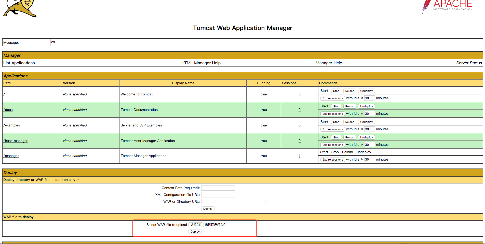

# Tomcat7+ 弱口令 && 后台getshell漏洞

Tomcat版本：7.?.* - 8.0.*

## 环境说明

Tomcat支持在后台部署war文件，可以直接将webshell部署到web目录下。其中，欲访问后台，需要对应用户有相应权限。

Tomcat7+权限分为：

 - manager（后台管理）
   - manager-gui 拥有html页面权限
   - manager-status 拥有查看status的权限
   - manager-script 拥有text接口的权限，和status权限
   - manager-jmx 拥有jmx权限，和status权限
 - host-manager（虚拟主机管理）
   - admin-gui 拥有html页面权限
   - admin-script 拥有text接口权限

这些权限的究竟有什么作用，详情阅读 http://tomcat.apache.org/tomcat-8.5-doc/manager-howto.html

在`conf/tomcat-users.xml`文件中配置用户的权限：

```xml
<?xml version="1.0" encoding="UTF-8"?>
<tomcat-users xmlns="http://tomcat.apache.org/xml"
              xmlns:xsi="http://www.w3.org/2001/XMLSchema-instance"
              xsi:schemaLocation="http://tomcat.apache.org/xml tomcat-users.xsd"
              version="1.0">

    <role rolename="manager-gui"/>
    <role rolename="manager-script"/>
    <role rolename="manager-jmx"/>
    <role rolename="manager-status"/>
    <role rolename="admin-gui"/>
    <role rolename="admin-script"/>
    <user username="tomcat" password="tomcat" roles="manager-gui,manager-script,manager-jmx,manager-status,admin-gui,admin-script" />
    
</tomcat-users>
```

可见，用户tomcat拥有上述所有权限，密码是`tomcat`。

正常安装的情况下，tomcat8中默认没有任何用户，且manager页面只允许本地IP访问。只有管理员手工修改了这些属性的情况下，才可以进行攻击。

## 漏洞测试

无需编译，直接启动整个环境：

```
docker compose up -d
```

打开tomcat管理页面`http://your-ip:8080/manager/html`，输入弱密码`tomcat:tomcat`，即可访问后台：


jsp木马-war包
```text
jar -cvf shell.war “shell.jsp”
```
上传war包即可直接getshell。
