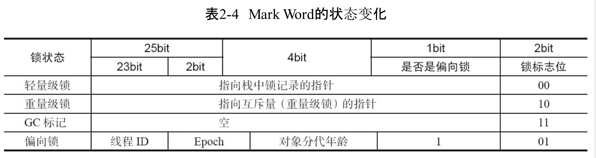
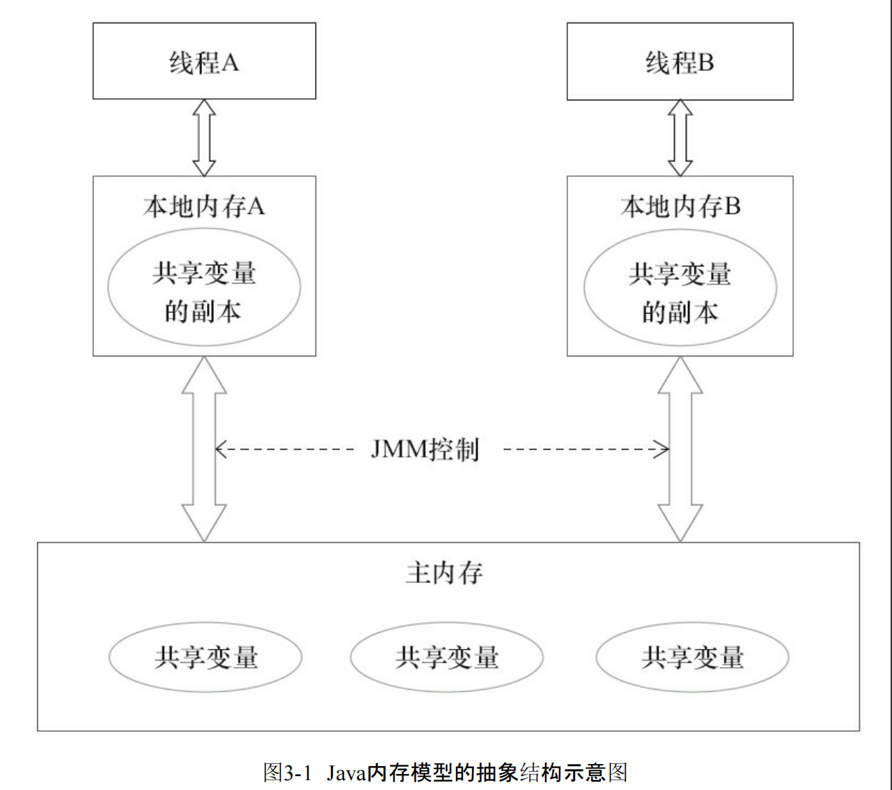
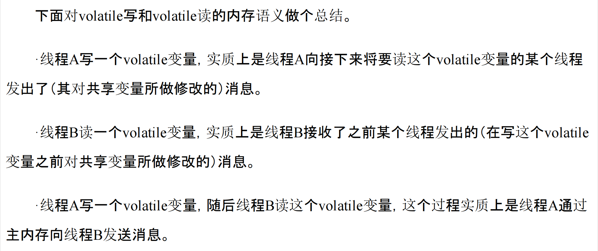
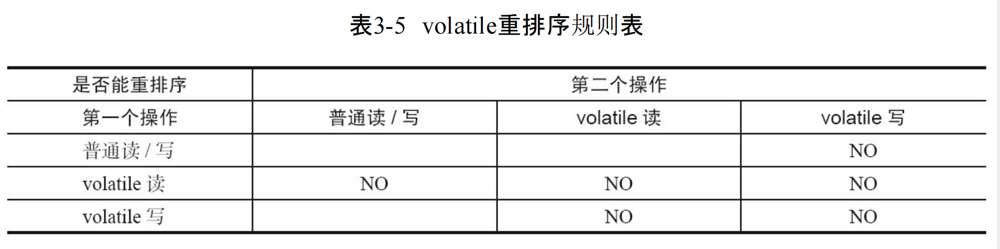

《java并发编程的的艺术》
# 第二章
## volatile
变量写在主内存(lock前缀引发) 线程间可见  
其他线程嗅探总线 并使cpu缓存失效  
volatile 无线程上下文切换  
## synchronized  
使用的锁在java对象头中markword标识    
什么是对象头? 一个Object有一个头表示对象的信息    
一个对象头中有markword 指针 数组长度   
  
synchronized 引入偏向锁 轻量级锁(cas自旋) 来减少重量级锁线程上下文切换  
cas底层通过总线锁/缓存锁来更新(lock指令来锁)cas同时具有volatile读和写的内存语意, 所以禁止和前后所有的读写重排序, 多线程时经常用   
synchronized底层使用monitor(监视器锁)  
# 第三章 java内存模型(JMM)
## 基础
在命令式编程中，线程之间的通信机制有两种：共享内存和消息传递  
实例域 静态域 数组元素 在堆中共享  
从抽象的角度来看，JMM定义了线程和主内存之间的抽象关系：线程之间的共享变量存储在主内存（Main Memory）中，每个线程都有一个私有的本地内存（Local Memory），本地内存中存储了该线程以读/写共享变量的副本  
  
JMM通过控制主内存与每个线程的本地内存之间的交互，来为Java程序员提供内存可见性保证  
重排序:  
编译器优化重排序(代码重排) - 指令级并行重排序(机器码重排) - 内存系统重排序  
对于处理器重排序，JMM的处理器重排序规则会要求Java编译器在生成指令序列时，插入特定类型的内存屏障，通过内存屏障指令来禁止特定类型的处理器重排序  
JMM属于语言级的内存模型，它确保在不同的编译器和不同的处理器平台之上，通过禁止特定类型的编译器重排序和处理器重排序，为程序员提供一致的内存可见性保证。  
## 重排序  
单线程保证不会发生错误 多线程有可能重排序导致结果不同  
## 顺序一致性  
一个理论理想模型, 重排序这块拿来和jmm进行比较    
分别比较了多线程同步和未同步两种情况二者重排序方面的差异  
## volatile  
可见性 原子性  
### write-read:  
happens-before:  
保证 多线程中 读之前的写 不会被重排序  
volatile写后会立即刷新到主存, 其他线程设置为无效 从主存拿  
  
  
volatile写不可与之前的所有读写重排序  
volatile读不可以与之后的所有读写重排序  
volatile写后读不许重排序  
(Store -> write, Load -> read)  
普通读&普通写 || `StoreStore` || volatile写 || `StoreLoad` || volatile读 || `LoadLoad&LoadStore` || 普通读&普通写  
如何使用volatile的一些例子参考: https://developer.aliyun.com/article/135547  
## lock
线程释放锁之后刷新到主存  
获取锁时致本地内存无效  
底层是volatile + cas
### unsafe.compareAndSwapInt()  
reentrantlock 获取锁的时候满足volatile写-读内存语意(上一个释放锁 写state 下一个获取锁 读state 禁止重排序)  
同时unfair.lock()中cas满足volatile读和写内存语意(禁止前后所有读写重排序), 参见intel cas说明/pdf-105  
### concurrent package  
volatile + cas 因为二者可以满足volatile相关内存语意  
## final
两点  
1.final成员构造不出构造函数  
2.引用对象赋值要在使用引用对象中final变量之前  
## happens-before  
happens-before关系保证正确同步的多线程程序的执行结果不被改变